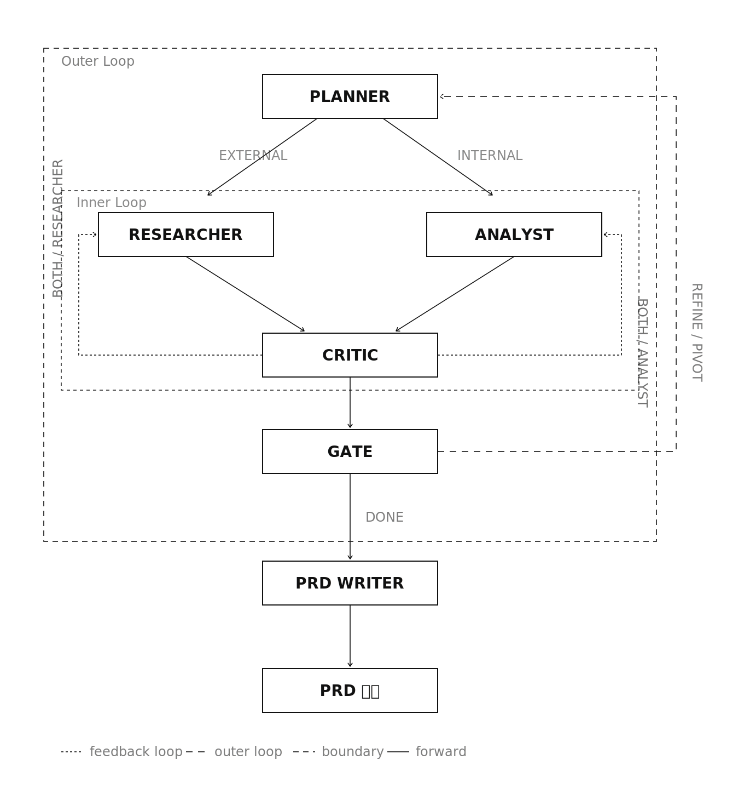

# IdeaVault

막연한 프로젝트 아이디어를 입력하면 멀티 에이전트 AI 파이프라인이 정제·검증하여 완성된 PRD(Product Requirements Document)를 생성하는 앱입니다.

---
## 에이전트 파이프라인 구조


**Inner Loop** (최대 3회): Critic이 정보가 부족하다고 판단하면 Researcher, Analyst, 또는 둘 다를 재호출합니다. 재수집된 결과는 다시 Critic으로 돌아옵니다.

**Outer Loop** (최대 3회): Critic을 통과하면 Gate가 주제 자체를 심사합니다. 개선이 필요하면(REFINE) 같은 주제로, 전환이 필요하면(PIVOT) 새 주제로 Planner를 다시 호출합니다. DONE이면 PRD Writer로 넘어갑니다.

| 에이전트 | 모델 | 역할 |
|---|---|---|
| Planner | MODEL_STRONG | 주제 발굴, EXTERNAL/INTERNAL 항목 생성 |
| Researcher | (LLM 없음) | Tavily 외부 검색 |
| Analyst | MODEL_LIGHT | 사용자 조건 대비 적합성 분석 |
| Critic | MODEL_STRONG | 정보 충분성 평가, 방향 결정 (Researcher/Analyst/Both/Gate) |
| Gate | MODEL_LIGHT | REFINE / PIVOT / DONE 결정 |
| PRD Writer | MODEL_STRONG | 8섹션 마크다운 PRD 작성 |

---

## 실행 방법

### 개발 환경 (로컬)

**1. 환경 변수 설정**

```bash
cp .env.example .env
```

```env
MODEL_STRONG=         # orchestrator·planner·critic·prd_writer 용 모델
MODEL_LIGHT=          # analyst·gate 용 모델
OPENROUTER_API_KEY=   # https://openrouter.ai
OPENROUTER_BASE_URL=https://openrouter.ai/api/v1
TAVILY_API_KEY=       # https://tavily.com  (미설정 시 researcher 비활성)
MAX_OUTER_LOOPS=3
MAX_INNER_LOOPS=3
USE_MOCK_MODE=true    # API 키 없이 UI 확인: true / 실제 파이프라인 실행: false
```

**2. 백엔드 실행**

```bash
cd backend
python -m venv venv && source venv/bin/activate
pip install -r requirements.txt
uvicorn main:app --reload --port 8000
```

**3. 프론트엔드 실행 (새 터미널)**

```bash
cd frontend && npm install && npm run dev   # http://localhost:5173
```

**4. 에이전트 CLI 단독 실행**

```bash
cd backend
source venv/bin/activate
python -m agents.run "B2B SaaS, 1인 개발, AI 활용, 월 100만원 수익 목표"
```

> `USE_MOCK_MODE=true`(기본값)로 처음 실행할 경우, `data/jobs/`에 완료된 job이 1개 이상 필요합니다. `USE_MOCK_MODE=false`로 실제 파이프라인을 한 번 돌려 샘플 job을 생성한 뒤 mock 모드를 사용하세요.

---

### Docker

프로젝트 루트(`ideavault/`)에서 실행합니다.

**1. 환경 변수 설정**

```bash
cp .env.example .env  # .env 파일 생성 후 API 키 입력
```

**2. 실행**

```bash
# 최초 실행 or 코드 변경 후
docker compose up --build -d

# 코드 변경 없을 때 (이미지 재사용)
docker compose up -d
```

| 서비스 | 주소 | 설명 |
|---|---|---|
| 프론트엔드 | http://localhost | nginx → React 빌드 결과물 |
| 백엔드 | http://localhost:8000 | FastAPI (uvicorn) |
| 헬스체크 | http://localhost:8000/health | `{"status":"ok"}` |

```bash
docker compose logs -f   # 로그 확인
docker compose down      # 종료
```

구성:
- `Dockerfile.backend` — Python 3.12, uvicorn
- `Dockerfile.frontend` — Node 20 빌드 → nginx 서빙
- `docker-compose.yml` — backend:8000, frontend:80, `.env` 주입, `data/jobs/` volume mount
- `nginx.conf` — `/stream`, `/generate` 등 API 경로를 backend로 reverse proxy

---

### CI/CD (예정)

GitHub Actions 기반. `main` 브랜치 push → Docker 이미지 빌드 → 레지스트리 푸시 → 배포.

필요한 GitHub Secrets: `OPENROUTER_API_KEY`, `TAVILY_API_KEY`, `MODEL_STRONG`, `MODEL_LIGHT`

---

## 오픈소스 라이선스

### Python 패키지 (백엔드)

| 패키지 | 용도 | 라이선스 | 선택 근거 | 대안 |
|---|---|---|---|---|
| [FastAPI](https://github.com/fastapi/fastapi) | REST API 서버 프레임워크 | MIT | Python 기반 API 프레임워크, async 지원 | Flask, Django |
| [uvicorn\[standard\]](https://github.com/encode/uvicorn) | ASGI 서버 | BSD-3-Clause | FastAPI 실행에 필요한 ASGI 서버. [standard]는 개발 중 자동 재시작 포함 | - |
| [sse-starlette](https://github.com/sysid/sse-starlette) | 에이전트 진행 상황을 실시간으로 프론트에 전달 (SSE 스트리밍) | BSD-3-Clause | SSE 직접 구현하면 연결 유지·종료 처리 코드가 복잡해짐 | StreamingResponse 직접 구현 |
| [langchain-core](https://github.com/langchain-ai/langchain) | LLM 파이프라인 추상화 | MIT | langchain-openai·deepagents 사용 시 필요한 메시지 타입 제공 | - |
| [langchain-openai](https://github.com/langchain-ai/langchain) | ChatOpenAI 인터페이스 | MIT | OpenRouter가 OpenAI 호환 API라 base_url만 교체해 그대로 사용| -  |
| [python-dotenv](https://github.com/theskumar/python-dotenv) | .env 환경변수 로딩 | BSD-3-Clause | Python에서 .env 파일 로딩하는 표준 방식 | - |
| [pandas](https://github.com/pandas-dev/pandas) | 토큰 사용량 집계 및 CSV 생성 | BSD-3-Clause | 데이터 집계·CSV 내보내기를 쉽게 처리 가능 | 직접 로직 구현 |
| [requests](https://github.com/psf/requests) | /ready 외부 서비스 상태 확인 | Apache-2.0 | 단순한 HTTP 라이브러리 | httpx |
| [deepagents](https://github.com/langchain-ai/deepagents) | Orchestrator LLM 에이전트 생성 | MIT | orchestrator가 상황에 따라 사용할 툴을 판단하고 선택 호출 필요 | LangGraph, 직접 구현 |
| [tavily-python](https://github.com/tavily-ai/tavily-python) | Researcher 에이전트 외부 검색 | MIT | 검색 결과를 LLM이 바로 읽기 좋은 형태로 반환 | serpapi, 직접 크롤링 |
| [pydantic](https://github.com/pydantic/pydantic) | API 요청/응답 스키마 검증 | MIT | FastAPI에 내장되어 있어 별도 선택 없이 사용 | - |

### npm 패키지 (프론트엔드)

| 패키지 | 용도 | 라이선스 | 선택 근거 | 대안 |
|---|---|---|---|---|
| [React](https://github.com/facebook/react) | UI 프레임워크 | MIT | 상태 관리가 많아 Vanilla JS로 직접 구현하면 코드가 복잡해짐 | Vanila JavaScript |
| [Vite](https://github.com/vitejs/vite) | 빌드 도구 및 개발 서버 | MIT | React 프로젝트 빌드 도구 | Create React App |
| [react-router-dom](https://github.com/remix-run/react-router) | 클라이언트 사이드 라우팅 | MIT | 페이지 이동 기능을 직접 구현하지 않아도 됨 | 직접 구현 |
| [react-markdown](https://github.com/remarkjs/react-markdown) | PRD 및 에이전트 출력 Markdown 렌더링 | MIT | React에서 마크다운을 렌더링하는 표준 방법 | - |
| [remark-gfm](https://github.com/remarkjs/remark-gfm) | GFM 확장 (표, 체크박스 등) | MIT | react-markdown 기본(CommonMark)만으로는 테이블 렌더링 안 됨 | - |

IdeaVault 라이선스: Apache-2.0
사용한 라이브러리 중 가장 엄격한 라이선스가 Apache-2.0이므로, 이 프로젝트도 Apache-2.0을 선택하였습니다. MIT/BSD 라이브러리는 Apache-2.0 프로젝트에 포함 가능하므로 라이선스 충돌이 없습니다.

### 보안 감사

`pip-audit`으로 의존성 보안 취약점을 검사해보았습니다. **프로젝트 런타임 의존성에는 알려진 취약점이 없습니다.**

확인된 취약점은 실행한 컴퓨터의 패키지 관리 도구(`pip` 24.0) 자체에만 해당하며, 프로젝트 실행 코드와 무관합니다.

```
Name  Version  ID             Fix Versions
----  -------  -------------  ------------
pip   24.0     CVE-2025-8869  25.3
pip   24.0     CVE-2026-1703  26.0
pip   24.0     CVE-2026-3219  (미정)
```

CVE-2025-8869: pip이 tar 패키지 설치 시 경로 검증 미흡 (의도치 않은 위치에 파일이 생성)
CVE-2026-1703: pip이 wheel 패키지 설치 시 경로 검증 미흡
CVE-2026-3219: pip이 tar과 zip파일이 혼합된 형태의 파일을 zip으로 오인하여 검증되지 않은 파일 설치

---

## 프로젝트 구조

```
ideavault/
├── backend/
│   ├── main.py                  # FastAPI 앱 + CORS + 라우터 등록 + /health + /ready
│   ├── config.py                # 환경변수 로딩 (필수값 미설정 시 EnvironmentError)
│   ├── requirements.txt
│   ├── routers/
│   │   ├── generate.py          # POST /generate
│   │   ├── stream.py            # GET /stream/{job_id}  (SSE)
│   │   ├── jobs.py              # GET /result/{job_id}, GET /result/{job_id}/prd.md
│   │   │                        # PATCH /jobs/{id}/favorite, POST /jobs/{id}/stop
│   │   │                        # DELETE /jobs/{id}
│   │   ├── history.py           # GET /history
│   │   ├── analytics.py         # GET /analytics, GET /analytics/csv
│   │   └── mock.py              # USE_MOCK_MODE=true 시 위 라우터 전체 대체
│   ├── services/
│   │   ├── storage.py           # 파일 I/O, USE_MOCK_MODE, DATA_DIR
│   │   └── pipeline.py          # 백그라운드 실행, job_queues, running_jobs, compute_cost
│   └── agents/
│       ├── orchestrator.py      # create_deep_agent 기반 오케스트레이터 (툴 12개)
│       ├── llm.py               # ChatOpenAI 팩토리, ContextVar 로거, 프롬프트 로더
│       ├── run.py               # CLI 진입점 (python -m agents.run "조건")
│       ├── subagents/
│       │   ├── planner.py       # MODEL_STRONG, max_tokens=1024
│       │   ├── researcher.py    # LLM 없음, Tavily 검색
│       │   ├── analyst.py       # MODEL_LIGHT, max_tokens=1536
│       │   ├── critic.py        # MODEL_STRONG, max_tokens=2048
│       │   ├── gate.py          # MODEL_LIGHT, max_tokens=512
│       │   └── prd_writer.py    # MODEL_STRONG, max_tokens=4096
│       └── prompts/             # 에이전트별 시스템 프롬프트 .md
├── frontend/
│   ├── src/
│   │   ├── api/
│   │   │   └── client.js        # 모든 fetch/EventSource 중앙화
│   │   ├── pages/
│   │   │   ├── Home.jsx / .css
│   │   │   ├── Analyze.jsx / .css
│   │   │   ├── Result.jsx / .css
│   │   │   ├── History.jsx / .css
│   │   │   ├── Analytics.jsx / .css
│   │   │   └── NotFound.jsx
│   │   ├── components/
│   │   │   ├── NavBar.jsx / .css
│   │   │   └── ChatBubble.jsx / .css
│   │   ├── App.jsx
│   │   └── main.jsx
│   ├── public/                  # 에이전트 아이콘 이미지
│   ├── vite.config.js           # API 경로 → localhost:8000 프록시
│   └── package.json
├── data/
│   └── jobs/{job_id}/           # meta.json, input.txt, result.json, prd.md, run.log
├── docs/                        # 개발 로그 및 AI 협업 기록
└── tools/                       # 크게 중요하지는 않지만, 차후 다시 사용할 경우를 대비해 저장해둔 코드
    └── agent_profile_color.py
    └── parse_log_to_job.py
```

---

## Claude Code와의 협업

IdeaVault는 인간과 AI의 역할을 분담한 협업 방식으로 개발되었습니다.

**사람이 담당한 것**

- **전체 아키텍처 설계**: 이중 루프 멀티 에이전트 파이프라인 구조, FastAPI ↔ 에이전트 연동 방식 직접 설계
- **에이전트 프롬프트 설계 및 최적화**: Claude 세션과 반복 논의를 통해 6개 에이전트 프롬프트를 직접 작성하고 개선. 입출력 형식, 선택 파라미터 처리, 에이전트 간 데이터 흐름을 프롬프트 레벨에서 설계
- **실행 결과 검수**: 파이프라인 실행 후 `run.log`로 에이전트별 I/O를 직접 분석하고 수정 방향 결정
- **핵심 아키텍처 결정**: `create_deep_agent` vs 순수 ChatOpenAI 직접 호출 비교 실험 후 선택 파라미터 빈 값 시 빈 출력 문제를 직접 발견하고 vanilla LLM으로 전환 결정
- **버그 발견 및 진단**: dotenv 로딩 순서, SSE stale closure, analytics 구조 불일치, `researcher model=None` AttributeError 등을 실제 실행 중 직접 발견
- **UX/디자인 스펙 정의**: 에이전트별 색상 팔레트, 레이아웃, 인터랙션 패턴을 상세 스펙으로 제시
- **AI 협업 파이프라인 기획**: Claude 세션(기획/프롬프트) → Ralph Loop(프론트엔드 반복 개발) → Claude Code(백엔드 구현) 흐름을 직접 설계하고 운영
- **보안 감사**: pip-audit으로 의존성 취약점 점검

**Claude Code가 담당한 것**: 설계된 아키텍처와 스펙을 코드로 일부 구현, 구조 재편, 주석 작성

협업 상세 기록은 `docs/ai-usage-log.md`에서 확인할 수 있습니다.

---

## 주요 기능

- **아이디어 입력**: 자유 텍스트로 프로젝트 아이디어 제출
- **실시간 에이전트 스트리밍**: SSE를 통해 에이전트 간 소통 과정을 채팅 형태로 실시간 확인
- **PRD 뷰어**: Markdown 렌더링 + 사이드 목차 네비게이션, `.md` 다운로드
- **히스토리**: 과거 세션 목록, 검색·정렬, 즐겨찾기, 기록 삭제
- **그래프보기**: 모델별 토큰 사용량(파이 차트), 날짜별 추이(스택 막대 차트), CSV 내보내기
